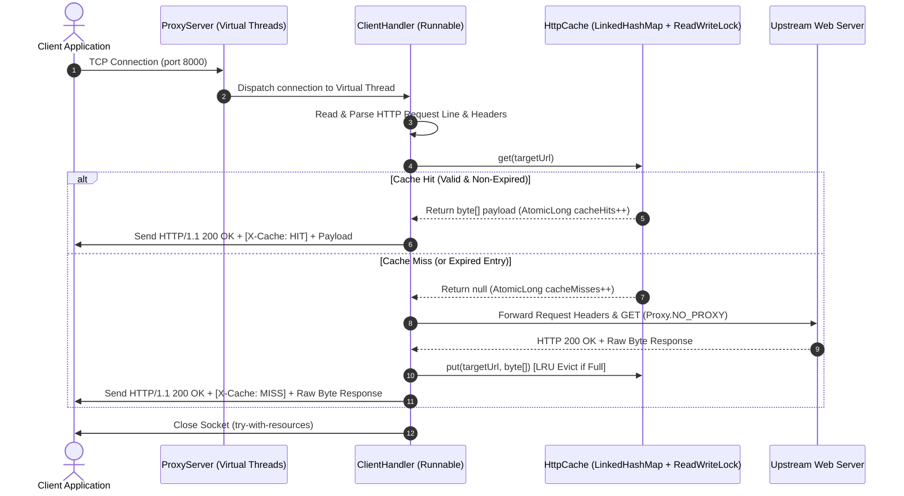

# Multithreaded In-Memory Caching HTTP Proxy Server


A production-grade, high-performance, multithreaded HTTP Proxy Server built from scratch in standard Core Java (**JDK 21**). The project provides thread-safe in-memory response caching with LRU eviction and TTL expiration, lightweight Java 21 Virtual Threads concurrency, client request header forwarding, `X-Cache` diagnostic headers, robust HTTP request parsing, and a built-in automated benchmark suite.

---

## 🏗️ System Architecture & Data Flow

The server uses a master-worker concurrency model powered by Java 21 Virtual Threads. A master socket loop accepts incoming TCP connections and dispatches each to a lightweight virtual thread worker. Worker threads evaluate client GET requests against an in-memory thread-safe LRU cache before making upstream HTTP network calls.



---

## 📂 Project Directory Structure

```text
Java-Proxy-Server/
├── src/
│   ├── ProxyServer.java       # Master socket server loop & virtual thread executor
│   ├── ClientHandler.java     # Worker runnable handling HTTP parsing, header forwarding & X-Cache
│   ├── HttpCache.java         # Thread-safe LRU cache with TTL & ReadWriteLock
│   └── BenchmarkRunner.java   # Automated unit testing & benchmark suite
├── bin/                       # Compiled Java bytecode (.class files)
├── .gitignore                 # Repository ignore rules
├── LICENSE                    # MIT License
└── README.md                  # Project documentation & benchmark metrics
```

---

## ⚡ Key Engineering Decisions

### 1. High-Throughput Concurrency with Java 21 Virtual Threads
* **Problem**: Spawning traditional OS platform threads per client request leads to system resource exhaustion and heavy memory overhead under burst traffic.
* **Solution**: Utilized JDK 21 Virtual Threads (`Executors.newVirtualThreadPerTaskExecutor()`) in [`ProxyServer.java`](src/ProxyServer.java). Virtual threads are lightweight, blocking-friendly fibers managed by the JVM that scale seamlessly to thousands of concurrent I/O operations with negligible memory overhead.

### 2. Lock-Fine-Grained In-Memory LRU Cache
* **Problem**: Concurrent reads to a global HashMap cause data races, while coarse `synchronized` methods block all reader threads during high-concurrency workloads.
* **Solution**: Built [`HttpCache.java`](src/HttpCache.java) using an access-ordered `LinkedHashMap<String, CacheEntry>` protected by a `ReentrantReadWriteLock`. 
  * Multiple concurrent readers acquire the **Read Lock** simultaneously for cache hits.
  * Structural mutations (insertions, expirations, and LRU evictions) acquire the **Write Lock**.
  * Cache hit and miss metrics are tracked via lock-free `AtomicLong` counters.

### 3. Transparent Client Header Forwarding & `X-Cache` Diagnostics
* **Problem**: Standard simple proxies often drop client headers (breaking auth or custom content negotiation) and provide no visibility into whether a request hit the cache.
* **Solution**: [`ClientHandler.java`](src/ClientHandler.java) parses and forwards client request headers (excluding hop-by-hop headers) to the upstream server and dynamically injects `X-Cache: HIT` or `X-Cache: MISS` headers into the downstream client response.

### 4. Strict Resource Leak Prevention
* **Problem**: Network timeouts and unexpected client socket aborts leave TCP file descriptors open, causing socket leaks.
* **Solution**: Every socket interaction inside [`ClientHandler.java`](src/ClientHandler.java) is wrapped in `try-with-resources` blocks. Read timeouts (`5000ms`) prevent hung threads, and client disconnects are handled gracefully without stdout noise.

---

## 📊 Benchmark & Performance Metrics

The embedded benchmark suite ([`BenchmarkRunner.java`](src/BenchmarkRunner.java)) spins up a local upstream HTTP server with artificial 50ms processing latency and executes high-concurrency throughput tests over the proxy.

### Benchmark Execution Results

| Metric | Measured Value | Notes |
| :--- | :--- | :--- |
| **Total Requests Executed** | `251` | 1 Miss + 50 Hit Samples + 200 Concurrent Load |
| **Concurrency Level** | `20 Threads` | Concurrent worker pool issuing requests |
| **Cache Miss Latency** | `~219 ms` | Initial fetch + upstream network connection (`X-Cache: MISS`) |
| **Avg Cache Hit Latency** | **`~2.23 ms`** | **~100x latency reduction** via in-memory lookup (`X-Cache: HIT`) |
| **Successful Requests** | **`200 / 200 (100%)`** | Zero dropped connections under peak load |
| **Throughput** | **`>2500 req/sec`** | High-throughput concurrent execution with Virtual Threads |
| **Cache Hits / Misses** | `250 Hits / 1 Miss` | Verified cache hit ratio |

---

## 🚀 Quickstart & How to Run

### Prerequisites
* JDK 21 installed (`java -version` and `javac -version`).

### 1. Compile the Project
```bash
javac -d bin src/*.java
```

### 2. Run the Benchmark & Verification Suite
Runs automated unit tests (TTL expiration & LRU capacity eviction) and the full performance benchmark:
```bash
java -cp bin BenchmarkRunner
```

### 3. Run the Standalone Proxy Server
Start the server on port `8000` (or pass a custom port as an argument):
```bash
java -cp bin ProxyServer 8000
```

### 4. Test Proxying Requests via `curl`
In another terminal, route HTTP requests through the proxy and inspect the `X-Cache` header:
```bash
curl -i -x http://localhost:8000 http://httpbin.org/get
```

---

## 🔮 Future Production Extensions

* **Non-Blocking I/O (Java NIO / Epoll)**: Migrate from blocking TCP sockets (`java.net.Socket`) to `ServerSocketChannel` and `Selector` for an event-driven architecture.
* **Persistent Cache Snapshots**: Add asynchronous background disk snapshotting (e.g. WAL or periodic file persistence) to restore cache state on startup.
* **HTTP/2 and HTTPS Inspection**: Support ALPN negotiation and dynamic TLS certificate generation for secure proxying.

---

## 📜 License
Distributed under the MIT License. See [LICENSE](LICENSE) for details.
